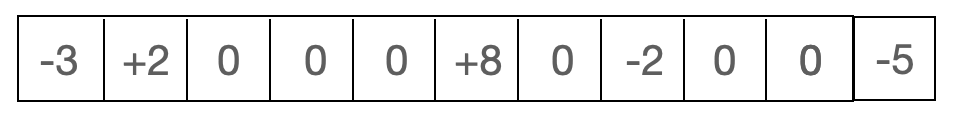

## 문제
[문제 링크](https://www.acmicpc.net/problem/19951)

## 풀이
 - 조교의 지시마다 즉각 반응하여 높이를 계산하면 100,000 * 100,000 = 10,000,000,000 이므로 시간초과가 발생한다.
 - 누적합을 이용하였다. 이전에 풀었던 누적합과는 조금 다른 방식이다.
 - 문제의 예제1을 기준으로 풀이는 다음과 같다.

 - a구간 부터 배열의 마지막까지 K를 더해준다.

 - b구간+1 부터 배열의 마지막까지 -K를 더해준다. 이렇게 하면 a구간부터 b구간까지 K만큼 더해주는 것과 같다.

 - 조교의 지시가 들어올 때 마다 누적합 배열을 채우면 시간초과가 나기 때문에 A와 B + 1번째에 대해서만 K를 표시해준다. 

 - 조교의 지시를 다 채우면 다음과 같은 모양이 된다.

 - 모든 조교의 지시를 다 받으면 누적합을 계산한다.

## 코드
~~~java
import java.io.BufferedReader;
import java.io.IOException;
import java.io.InputStreamReader;
import java.util.StringTokenizer;

public class Main {
    static BufferedReader br = new BufferedReader(new InputStreamReader(System.in));
    static int N, M;
    static int[] ground, prefixSum;

    public static void main(String[] args) throws IOException {
        input();

        solve();

        print();
    }

    private static void input() throws IOException {
        StringTokenizer st = new StringTokenizer(br.readLine());
        N = Integer.parseInt(st.nextToken());
        M = Integer.parseInt(st.nextToken());

        ground = new int[N + 1];
        prefixSum = new int[N + 2];
        st = new StringTokenizer(br.readLine());
        for (int i = 1; i <= N; i++) {
            ground[i] = Integer.parseInt(st.nextToken());
        }

        for (int i = 1; i <= M; i++) {
            st = new StringTokenizer(br.readLine());
            int start = Integer.parseInt(st.nextToken());
            int end = Integer.parseInt(st.nextToken());
            int value = Integer.parseInt(st.nextToken());

            // A구간과 B + 1구간에 K와 -K를 더해준다.
            prefixSum[start] += value;
            prefixSum[end + 1] -= value;
        }
    }

    private static void solve() {
        // 조교의 지시가 다 끝나면 누적합 배열을 계산한다.
        for (int i = 1; i <= N; i++) {
            prefixSum[i] += prefixSum[i - 1];
            ground[i] += prefixSum[i];
        }
    }

    private static void print() {
        StringBuilder sb = new StringBuilder();
        for (int i = 1; i <= N; i++) {
            sb.append(ground[i]).append(" ");
        }
        System.out.println(sb);
    }
}

~~~
